# CI/CD Pipeline for PHP Application with Jenkins, Ansible, SonarQube & Artifactory

A complete DevOps pipeline demonstration that integrates Jenkins for Continuous Integration, Ansible for automated deployment, SonarQube for code quality, and JFrog Artifactory for artifact management, applied to a PHP-based web application.

---
## Project Overview

This project simulates a real-world CI/CD pipeline for a PHP web application. It covers:

- **Automated builds with Jenkins**
- **Dependency management with Composer**
- **Code quality checks with SonarQube**
- **Artifact storage in JFrog Artifactory**
- **Deployment automation via Ansible**
- **Serving PHP application with Nginx**

The pipeline ensures repeatable, reliable, and maintainable deployments.

---
## Architecture Overview
```yaml
GitHub (Source Code)
        |
        v
   Jenkins (CI/CD Pipeline)
        |
  -----------------
  |               |
SonarQube      Artifactory
(Code Quality) (Artifact Storage)
        |
        v
   Ansible Playbooks
        |
        v
   Target Servers (AWS EC2)
        |
        v
    Nginx + PHP App
```

### Flow:

**1. Developer pushes code to GitHub → triggers Jenkins pipeline via webhook**

**2. Jenkins pulls code, installs dependencies, runs tests, and triggers code analysis**

**3. Artifacts are pushed to Artifactory**

**4. Ansible deploys the application to web servers**

**5. Nginx serves the PHP application**

---
## Prerequisites

- **Servers:** AWS EC2 instances or equivalent
- **Access:** GitHub repository with personal access token
- **Installed software:**
  - Git
  - PHP 8.x
  - Composer
  - Jenkins
  - Ansible
  - Ngin
  - SonarQube
  - JFrog Artifactory

- **Basic knowledge:** Git, Linux CLI, and DevOps concepts

---
## Project Setup

### Step 1. Create Repo Structure

**1.1 Create the Ansible project structure with roles and configurations:**

```bash
mkdir ci-cd project
mkdir -p ansible/{inventories/{ci,dev,pentest},roles/{webserver,artifactory/tasks,jenkins/tasks,nginx,php/tasks,sonarqube/tasks},playbooks}
mkdir deploy
touch deploy/Jenkinsfile
touch ansible.cfg
mkdir -p group_vars/{dev,pentest}
nano ansible/inventories/ci/hosts.ini
nano ansible/inventories/dev/hosts.ini
nano ansible/inventories/pentest/hosts.ini
nano ansible/playbooks/deploy_from_artifactory.yml

# For role in jenkins sonarqube artifactory php nginx webserver; do   
mkdir -p $role/{tasks,handlers,templates,files,defaults,meta};   touch $role/tasks/main.yml; done

# Create main playbook 
touch ansible/site.yml
```
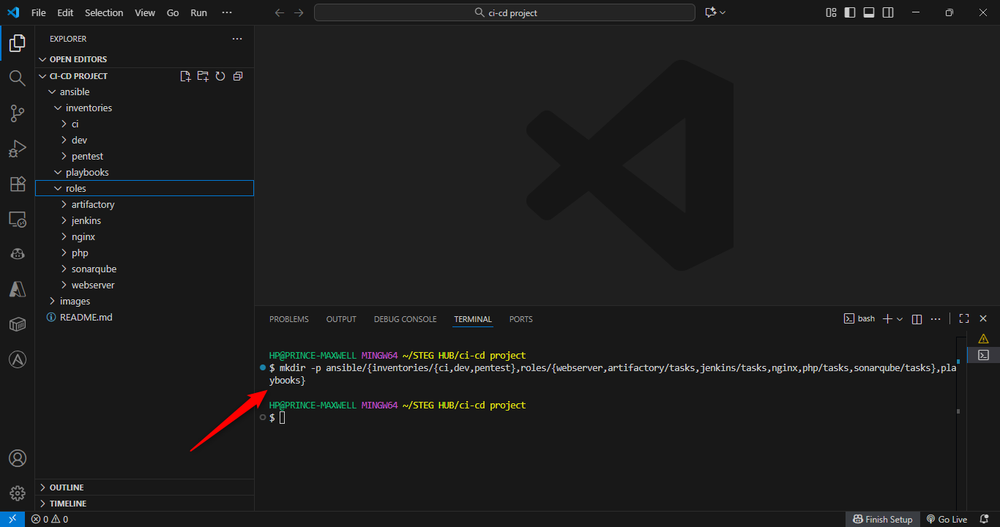

**1.2 Configure Group Variables**
Set up the group variables file for Ansible inventory management.

Commands:
```bash
# Edit group variables
nano group_vars/all.yml
```
Content for group_vars/all.yml:
```yml
---
ansible_user: ubuntu
ansible_ssh_private_key_file: ~/.ssh/your-key.pem
ansible_ssh_common_args: '-o StrictHostKeyChecking=no'
```
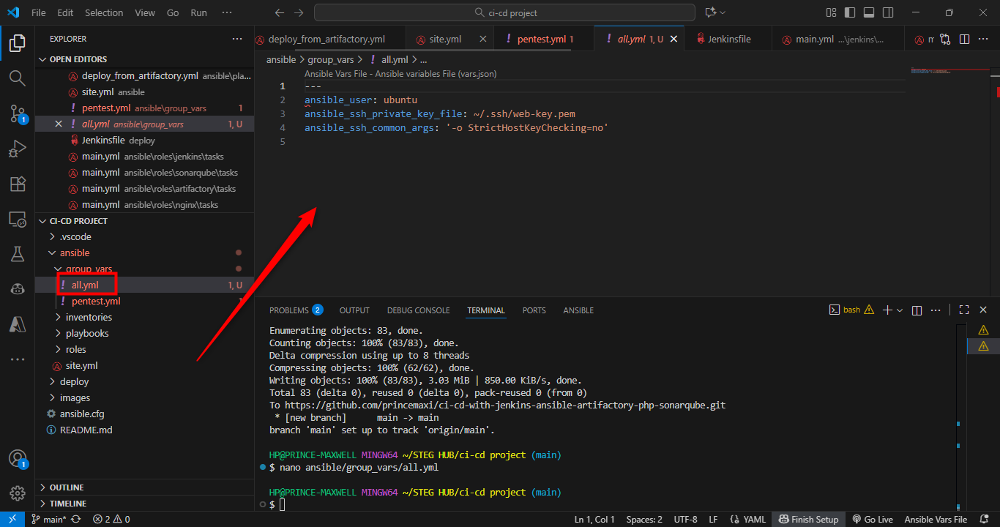

**1.3 Infrastructure Verification: Server Connectivity Test**
Verify all servers are reachable via Ansible ping module.

Commands:
```bash
# Test connectivity to all servers
ansible all -i inventories/hosts -m ping
# Test specific group
ansible webservers -i inventories/hosts.ini -m ping
```

Sample inventories/host.ini file:
```ini
[Todo]
web1 ansible_host=10.0.1.10

[jenkins]
jenkins ansible_host=10.0.1.20

[sonarqube]
sonar ansible_host=10.0.1.30
```
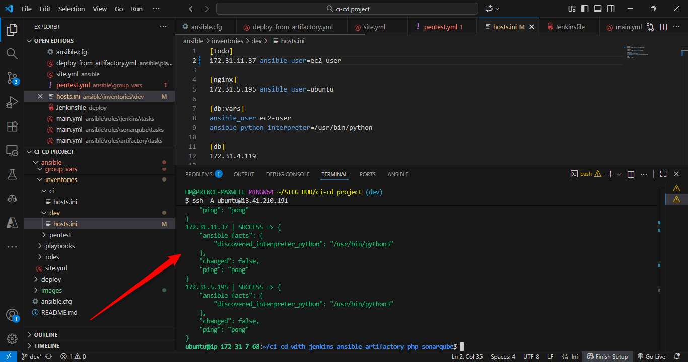

### Step 2: GitHub Integration

**2.1 Generate GitHub Access Token**

Create a personal access token for Jenkins to access your repository.

**Steps:**

- Go to GitHub → Settings → Developer settings → Personal access tokens
- Click "Generate new token (classic)"
- Select scopes: repo, admin:repo_hook
- Copy the generated token

---

### Step 3. Provision servers (high level)

Create instances (or VMs). Give them static IPs or note their public/private IPs.

**3.1 Suggested instance sizes (for this project):**

- Jenkins (and Ansible control): 2 vCPU / 4 GB RAM
- SonarQube: 2 vCPU / 8 GB RAM (Sonar needs more memory)
- Artifactory: 2 vCPU / 4 GB RAM + EBS storage
- Web server: 1–2 vCPU / 2 GB RAM
- Nginx server : 1–2 vCPU / 2 GB RAM

**3.2 Open ports in security groups:**

- SSH (22) from your IP
- Jenkins (8080)
- SonarQube (9000)
- Artifactory (8082)
- HTTP (80) to web servers

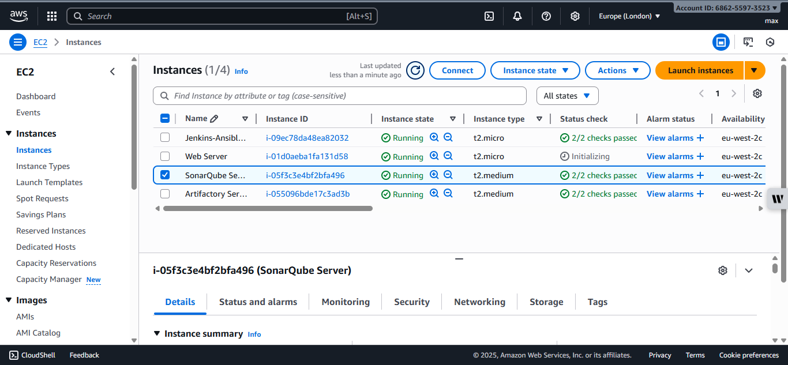

### Step 4. Setup Jenkins server (also used as Ansible control node)

**4.1 Install Java & Jenkins (run on Jenkins server)**
```bash
sudo apt install -y openjdk-11-jdk
sudo wget -O /usr/share/keyrings/jenkins-keyring.asc \
  https://pkg.jenkins.io/debian-stable/jenkins.io-2023.key
echo deb [signed-by=/usr/share/keyrings/jenkins-keyring.asc] \
  https://pkg.jenkins.io/debian-stable binary/ | sudo tee \
  /etc/apt/sources.list.d/jenkins.list > /dev/nul
sudo apt update
sudo apt install -y jenkins
sudo systemctl enable --now jenkins
sudo systemctl status jenkins --no-pager
```
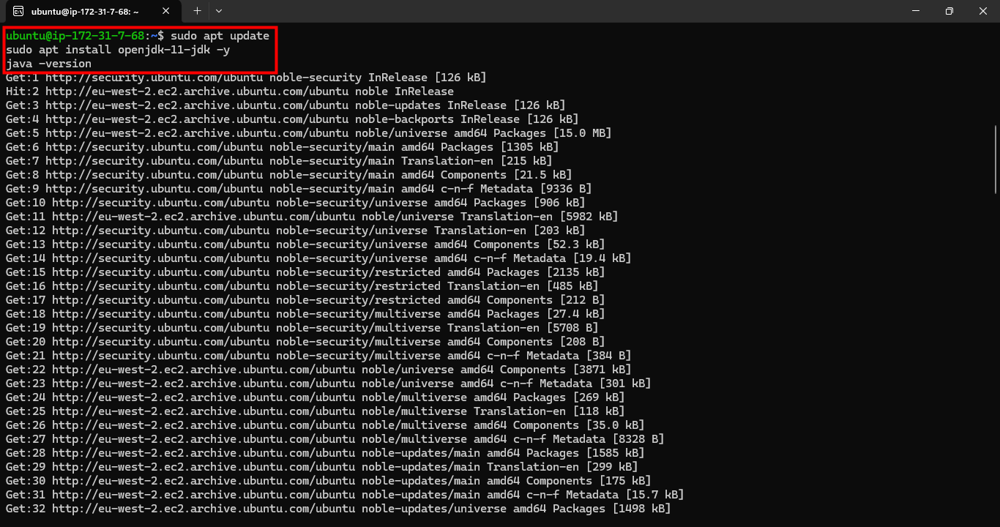
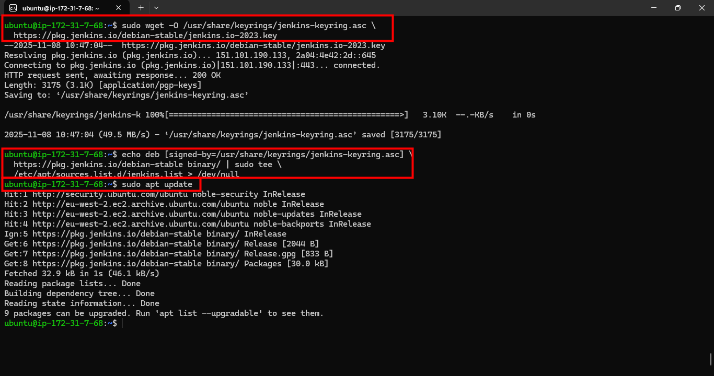
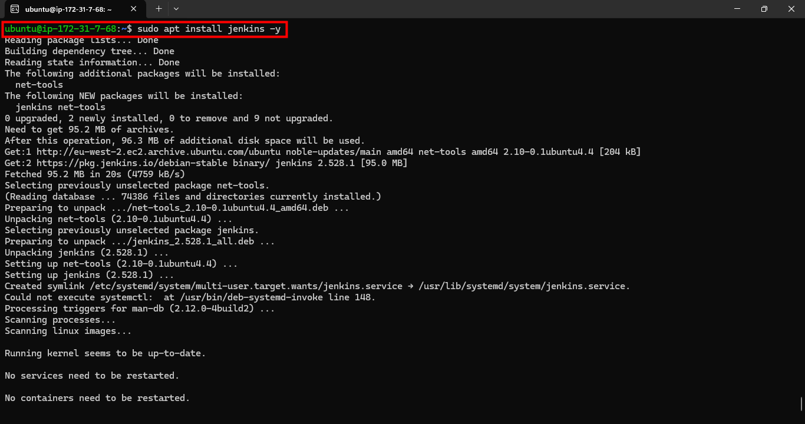
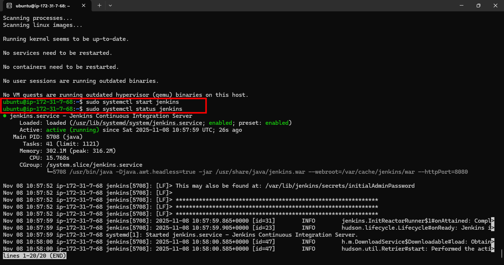

**Get initial admin password:**
```bash
sudo cat /var/lib/jenkins/secrets/initialAdminPassword
```
Open `http://JENKINS_IP:8080 `in browser, paste initial password, install recommended plugins, create admin user.
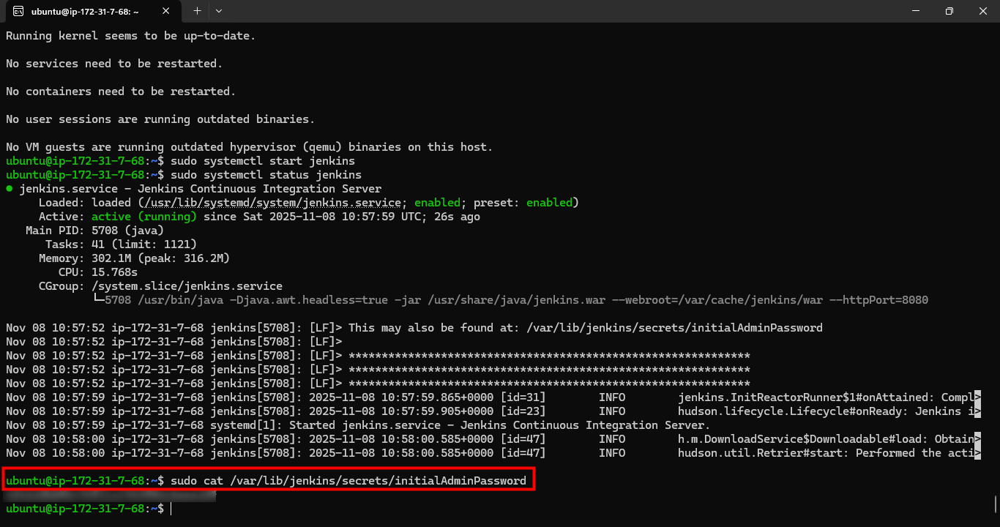
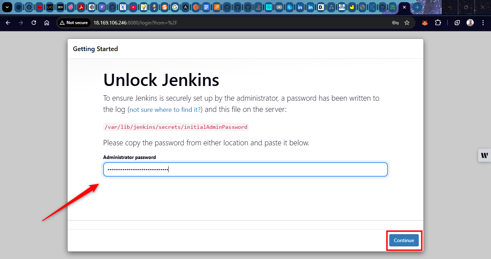

**4.2 Install Ansible on Jenkins server (control node)**
```bash
sudo apt update
sudo apt install -y ansible python3-venv
ansible --version
```
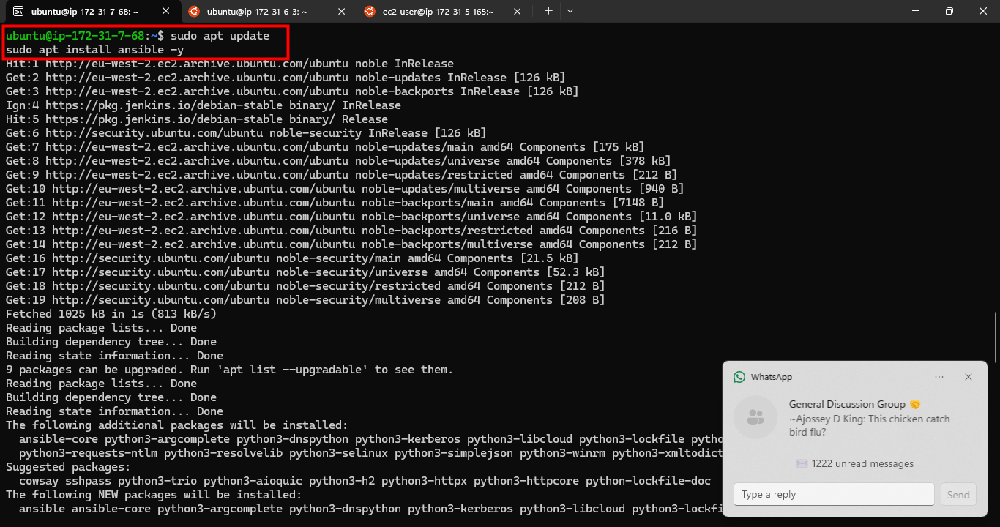


**4.3 Add Jenkins plugins (via UI)**

**Go to Manage Jenkins → Manage Plugins → Available and install:**

- Pipeline
- Git plugin
- GitHub Integration Plugin / GitHub Branch Source
- Ansible plugin
- SonarQube Scanner for Jenkins
- JFrog Artifactory plugin 
- Blue Ocean (optional)

Restart Jenkins if asked.


**4.4 Add credentials in Jenkins (UI)**

**Manage Jenkins → Credentials → Global → Add:**

- GitHub token — Kind: Username with password, ID: github-token
- Sonar token — Kind: Secret text, ID: sonarqube-token (you’ll create token in Sonar later)
- Artifactory credentials — Kind: Username with password, ID: artifactory-cred (you’ll create token in Artifactory later)
- SSH key — Kind: SSH Username with private key, Username: ubuntu, paste private key ~/.ssh/ansible_id_ed25519, ID: ansible-ssh

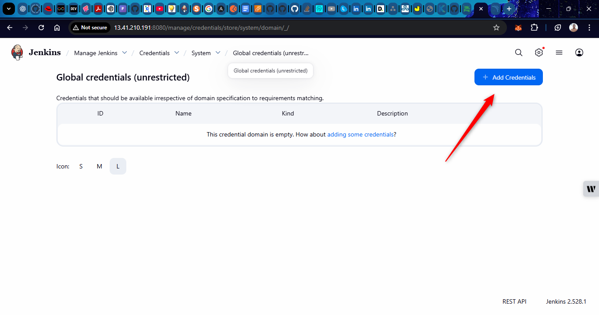
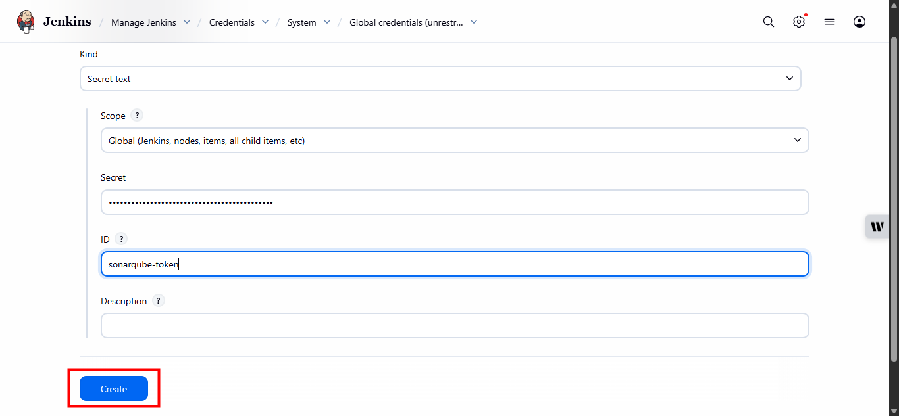

### Step 5. SonarQube server
**5.1 Install Java and SonarQube**

Run on Sonar server:
```bash
sudo apt update
sudo apt install -y openjdk-11-jdk unzip
wget https://binaries.sonarsource.com/Distribution/sonarqube/sonarqube-9.9.0.65466.zip
unzip sonarqube-9.9.0.65466.zip
sudo mv sonarqube-9.9.0.65466 /opt/sonarqube
sudo useradd -r -s /bin/false sonar
sudo chown -R sonar:sonar /opt/sonarqube
```

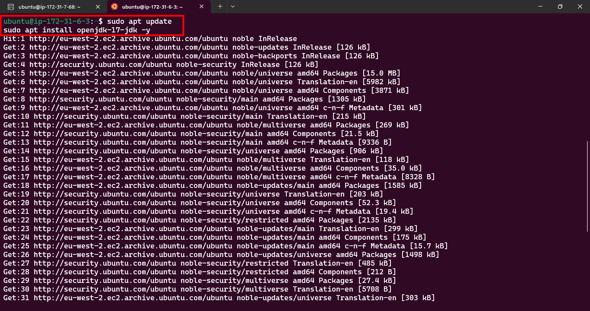
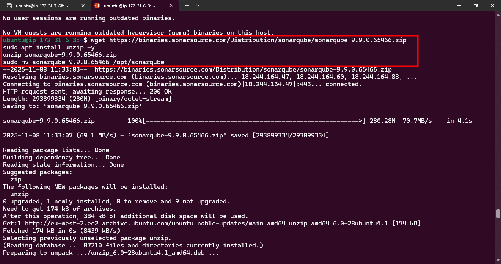
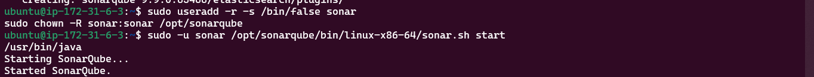

**2.2 Create systemd service:**
```bash
sudo tee /etc/systemd/system/sonarqube.service > /dev/null <<'EOF'
[Unit]
Description=SonarQube service
After=syslog.target network.target

[Service]
Type=forking
ExecStart=/opt/sonarqube/bin/linux-x86-64/sonar.sh start
ExecStop=/opt/sonarqube/bin/linux-x86-64/sonar.sh stop
User=sonar
Group=sonar
Restart=always
LimitNOFILE=65536
LimitNPROC=4096

[Install]
WantedBy=multi-user.target
EOF

sudo systemctl daemon-reload
sudo systemctl enable --now sonarqube
sudo journalctl -u sonarqube -f --no-pager
```

**2.3 Generate SonarQube token**

Open `http://SONAR_IP:9000` and login `admin/admin`. Generate token: My Account → Security → Tokens → Generate. Save token — put it into Jenkins credentials as `sonarqube-token`.


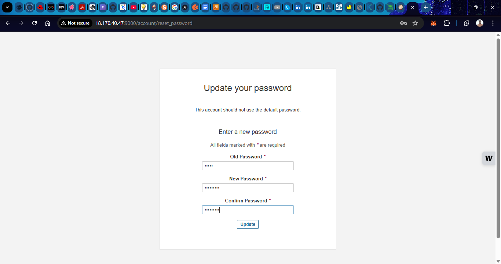
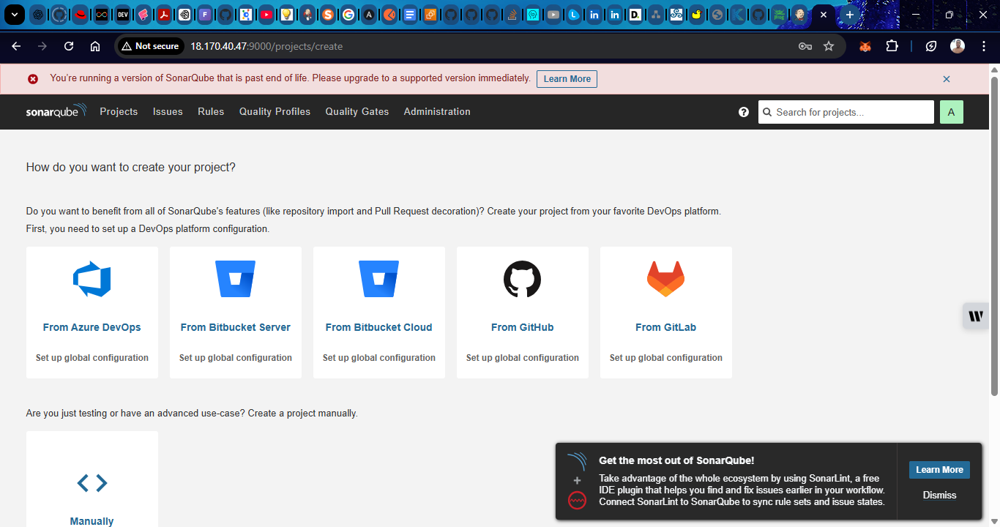
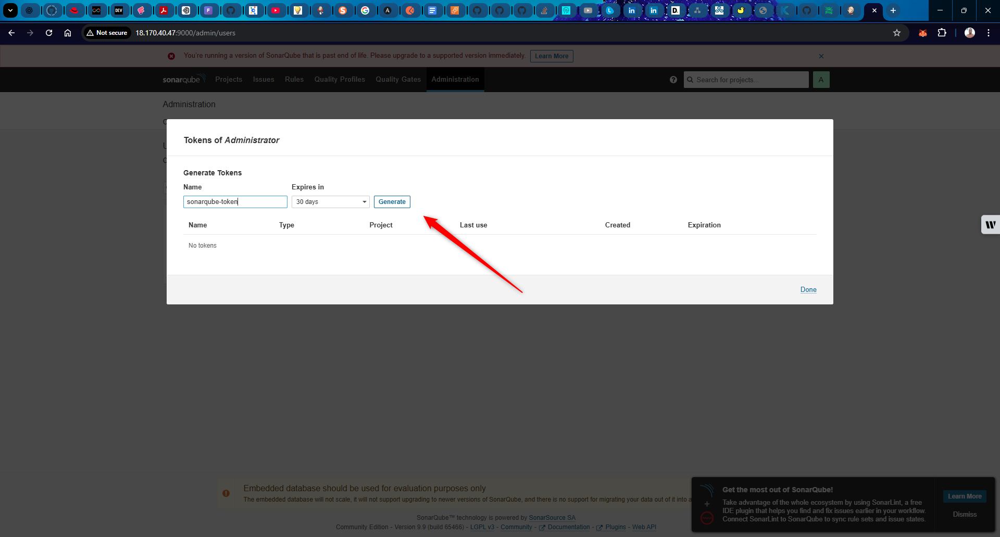

### Step 6: JFrog Artifactory Setup

Deploy and configure the artifact repository manager.

```bash
# Download and install Artifactory
wget -qO - https://releases.jfrog.io/artifactory/api/gpg/key/public | sudo apt-key add -
echo "deb https://releases.jfrog.io/artifactory/artifactory-debs xenial main" | sudo tee /etc/apt/sources.list.d/artifactory.list
sudo apt update
sudo apt install jfrog-artifactory-oss
# Start Artifactory service
sudo systemctl start artifactory
sudo systemctl enable artifactory
```

For quick setup here we used the cloud based Jfrog Artifactory:
- Sign up on `https://jfrog.com/artifactory/`
- Setup a trial version
- get your artifactory domain
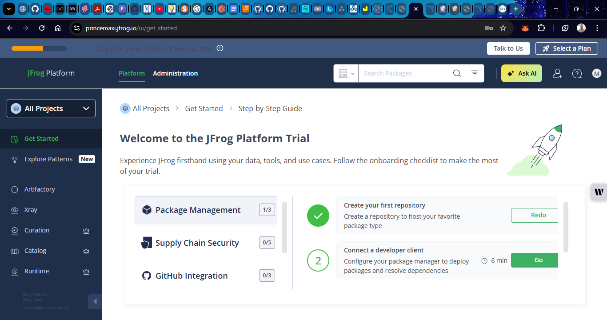

- After setup, generate your token and integrate in Jenkins
- Create your repo and copy link to be used in your pipeline.

### Step 7: ansible.cfg — make roles_path robust for multibranch runs

Create ansible/ansible.cfg (this will be kept under SCM next to Jenkinsfile and exported via Jenkins env var).

```yml
[defaults]
inventory = ./inventories/{{inventory}}/hosts.ini
roles_path = ./roles
host_key_checking = False
forks = 10
retry_files_enabled = False
jinja2_extensions = jinja2.ext.do

[ssh_connection]
pipelining = True
control_path = %(directory)s/%%h-%%r
```
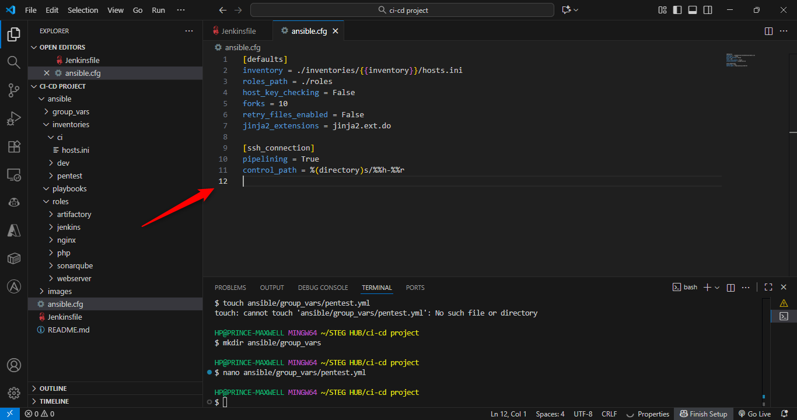

> Important Jenkins note: Because pipelines run from different branches and workspace paths, export the ANSIBLE_CONFIG environment variable pointing to the workspace file. Jenkinsfile will set ANSIBLE_CONFIG=${WORKSPACE}/ansible/ansible.cfg before running playbooks.

### Step 8: Ansible playbook to download artifact (use get_url / unarchive)

Create ansible/playbooks/deploy_from_artifactory.yml:

```yml
---
- name: Deploy Todo App from Artifactory
  hosts: "{{ target_group | default('webservers') }}"
  become: yes
  vars:
    artifactory_base: "https://princemaxi.jfrog.io/artifactory/php-todo-repo" 
    app_group: "todo-app"
    artifact_path: "{{ artifactory_base }}/{{ app_group }}/{{ commit_hash }}/{{ build_number }}.tar.gz"
    release_dir: /var/www/releases
    current_link: /var/www/html
  tasks:

    - name: Ensure release dir exists
      file:
        path: "{{ release_dir }}"
        state: directory
        owner: nginx
        group: nginx
        mode: '0755'

    - name: Download artifact from Artifactory
      get_url:
        url: "{{ artifactory_base }}/todo-app/{{ commit_hash }}/{{ build_number }}/todo-app-{{ commit_hash }}-{{ build_number }}.tar.gz"
        dest: "/tmp/todo-app-{{ build_number }}.tar.gz"
        timeout: 60
        url_username: "{{ artifactory_user }}"   # Pass this from Jenkins
        url_password: "{{ artifactory_pass }}" # Pass this from Jenkins
        force: yes
        mode: '0644'
        validate_certs: no
      register: download_result

    - name: Fail if artifact not downloaded
      fail:
        msg: "Artifact download failed: {{ artifact_path }}"
      when: download_result is failed

    - name: Create build-specific release directory
      file:
        path: "/var/www/releases/{{ build_number }}"
        state: directory
        owner: nginx
        group: nginx
        mode: '0755'

    - name: Extract artifact to release dir
      unarchive:
        src: "/tmp/{{ app_group }}-{{ build_number }}.tar.gz"
        dest: "{{ release_dir }}/{{ build_number }}"
        remote_src: yes

    - name: Update current symlink
      file:
        src: "{{ release_dir }}/{{ build_number }}"
        dest: "{{ current_link }}"
        state: link
        force: yes

    - name: Set permissions on release directory
      file:
        path: "/var/www/releases/{{ build_number }}"
        owner: nginx
        group: nginx
        mode: '0755'
        recurse: yes

    - name: Restart nginx
      systemd:
        name: nginx
        state: restarted
```
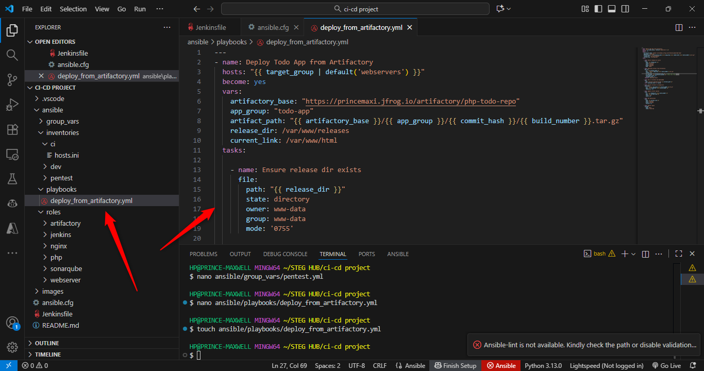

When Jenkins triggers this playbook, pass extra vars:

- `build_number` = `${BUILD_NUMBER}`

- `commit_hash` = `${GIT_COMMIT}` (or a tag/semantic version)

- `target_group` = `todo` / `tooling` / whichever inventory group you target.

Example ansible CLI (from Jenkins agent):
```bash
ANSIBLE_CONFIG=${WORKSPACE}/ansible/ansible.cfg \
ansible-playbook ansible/playbooks/deploy_from_artifactory.yml \
  -i ansible/inventories/${inventory}/hosts.ini \
  --extra-vars "build_number=${BUILD_NUMBER} commit_hash=${GIT_COMMIT} target_group=todo"
```

This ensures the artifact is deployed from Artifactory rather than git.

### Step 9: Complete, production-style Jenkinsfile (parameterized)

Put this Jenkinsfile in infrastructure-repo/deploy/Jenkinsfile (Blue Ocean or multibranch points to deploy/Jenkinsfile). This is a full pipeline: checkout infra, checkout app, build, sonar, quality gate, upload artifact, deploy via Ansible.

```groovy
pipeline {
    agent any

    parameters {
        // Changed to HTTPS URL to work with 'github-token'
        string(name: 'APP_REPO', defaultValue: 'https://github.com/princemaxi/php-todo.git', description: 'App repo to build')
        string(name: 'APP_BRANCH', defaultValue: 'main', description: 'Branch to build')
        choice(name: 'inventory', choices: ['ci','dev','pentest'], description: 'Target inventory to use (folder under ansible/inventories)')
        string(name: 'ansible_tags', defaultValue: '', description: 'Optional Ansible tags (comma separated)')
    }

    environment {
        // --- Configuration ---
        // 1. SonarQube Token (matches your credentials)
        SONAR_TOKEN = credentials('sonarqube-token')
        // 2. SonarQube Host (FIX: Updated to your new public IP)
        SONAR_HOST = "http://13.40.142.176:9000"
        // 3. Artifactory Host (using your cloud URL)
        ARTIFACTORY_HOST = "https://princemaxi.jfrog.io"
    }

    stages {
        stage('Checkout Infra (Ansible)') {
            steps {
                // Checks out the Ansible configuration from *this* repository
                checkout scm
            }
        }

        stage('Checkout App (PHP)') {
            steps {
                dir('todo-app') {
                    // Checks out the PHP app using your 'github-token'
                    git credentialsId: 'github-token', url: params.APP_REPO, branch: params.APP_BRANCH
                    script {
                        // Grabs the Git commit ID to use as a version
                        env.GIT_COMMIT = sh(returnStdout: true, script: 'git rev-parse --short HEAD').trim()
                    }
                }
            }
        }

        stage('Build / Package') {
            steps {
                dir('todo-app') {
                    sh '''
                        set -e
                        rm -rf dist || true
                        mkdir -p dist

                        # Use rsync to copy app files from root (.) to dist/, excluding .git
                        rsync -av --progress . dist/ --exclude .git

                        # Creates the tarball for upload
                        tar -czf ../todo-app-${GIT_COMMIT}-${BUILD_NUMBER}.tar.gz -C dist .
                    '''
                }
                // Saves the artifact in Jenkins for review
                archiveArtifacts artifacts: "todo-app-${GIT_COMMIT}-${BUILD_NUMBER}.tar.gz", fingerprint: true
            }
        }

        stage('SonarQube Analysis') {
            when {
                anyOf {
                    branch 'main'
                    branch 'develop'
                }
            }
            steps {
                dir('todo-app') {
                    sh '''
                        echo "--- Running SonarQube Analysis ---"
                        echo "Current directory:"
                        pwd
                        echo "Directory contents:"
                        ls -la

                        /opt/sonar-scanner/bin/sonar-scanner \
                          -Dsonar.projectKey=php-todo \
                          -Dsonar.sources=. \
                          -Dsonar.exclusions=dist/** \
                          -Dsonar.javascript.exclusions=**/* \
                          -Dsonar.css.exclusions=**/* \
                          -Dsonar.typescript.exclusions=**/* \
                          -Dsonar.host.url=$SONAR_HOST \
                          -Dsonar.login=$SONAR_TOKEN
                    '''
                }
            }
        }


        stage('Upload artifact to Artifactory') {
            steps {
                // Securely loads your 'artifactory-token'
                withCredentials([usernamePassword(credentialsId: 'artifactory-token', usernameVariable: 'ART_USER', passwordVariable: 'ART_PASS')]) {
                    sh """
                        # Sets the path using your correct repository 'php-todo-repo'
                        ART_PATH="php-todo-repo/todo-app/${GIT_COMMIT}/${BUILD_NUMBER}/todo-app-${GIT_COMMIT}-${BUILD_NUMBER}.tar.gz"

                        # *** FIX: Escaped \$ART_PATH ***
                        # Uploads the file using your cloud URL and credentials
                        curl -u ${ART_USER}:${ART_PASS} -T todo-app-${GIT_COMMIT}-${BUILD_NUMBER}.tar.gz "${ARTIFACTORY_HOST}/artifactory/\${ART_PATH}"

                        # *** FIX: Escaped \$ART_PATH ***
                        echo "ARTIFACT_PATH=${ARTIFACTORY_HOST}/artifactory/\${ART_PATH}" > artifact-info.txt
                    """
                }
                archiveArtifacts artifacts: 'artifact-info.txt'
            }
        }

        stage('Deploy via Ansible') {
            steps {
                // *** FIX: Added 'artifactory-token' to load ART_USER and ART_PASS ***
                withCredentials([
                    sshUserPrivateKey(credentialsId: 'ansible-ssh', keyFileVariable: 'ANSIBLE_KEY'),
                    usernamePassword(credentialsId: 'artifactory-token', usernameVariable: 'ART_USER', passwordVariable: 'ART_PASS')
                ]) {
                    sh '''
                        export ANSIBLE_CONFIG=${WORKSPACE}/ansible/ansible.cfg

                        # Removed '-u' so Ansible uses the user defined in your inventory files
                        ansible-playbook -i ansible/inventories/${inventory}/hosts.ini ansible/playbooks/deploy_from_artifactory.yml \
                          --private-key=${ANSIBLE_KEY} \
                          --extra-vars "build_number=${BUILD_NUMBER} commit_hash=${GIT_COMMIT} target_group=todo" \
                          --extra-vars "artifactory_base=${ARTIFACTORY_HOST}/artifactory/php-todo-repo" \
                          --extra-vars "artifactory_user=${ART_USER} artifactory_pass=${ART_PASS}"
                    '''
                }
            }
        }
    }

    post {
        always {
            cleanWs()
        }
    }
}
```

**Notes & tips:**

- Create Jenkins credentials named exactly as used (sonarqube-token, artifactory-user, artifactory-password, ansible-ssh).
- If sonar-scanner is not installed on agent, run it via a Docker step or install it as a Jenkins tool.
- The when block limits Sonar scanning/Quality gate to important branches per your policy.

### Step 10: Nginx Reverse Proxy Configuration

To make the deployed PHP application accessible via a clean domain or public IP (without specifying port numbers), Nginx is configured as a reverse proxy in front of the PHP-FPM service.

Below are the full steps and commands used to configure and verify Nginx on the web server (e.g., EC2 instance).

**10.1: Install Nginx**
```
sudo dnf install nginx -y
```

Enable and start Nginx service:
```
sudo systemctl enable nginx
sudo systemctl start nginx
sudo systemctl status nginx
```
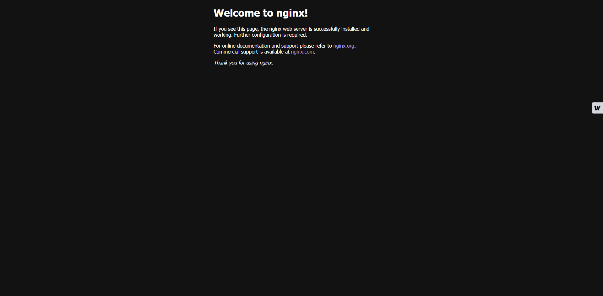

**10.2: Verify PHP-FPM Service**

Ensure that PHP-FPM is installed and running:
```bash
sudo systemctl enable php-fpm
sudo systemctl start php-fpm
sudo systemctl status php-fpm
```

Check its socket location:
```
sudo ls /run/php-fpm/
```

(Usually, the socket path is /run/php-fpm/www.sock or /var/run/php-fpm/www.sock.)

**10.3: Configure Nginx Server Block (Reverse Proxy)**

Edit the default Nginx configuration file:
```bash
sudo vi /etc/nginx/conf.d/default.conf
```

Replace the content with the following configuration:
```bash
server {
    listen 80;
    server_name _;

    root /var/www/html/public;
    index index.php index.html index.htm;

    location / {
        try_files $uri $uri/ =404;
    }

    location ~ \.php$ {
        include fastcgi_params;
        fastcgi_pass unix:/run/php-fpm/www.sock;   # adjust if socket path differs
        fastcgi_index index.php;
        fastcgi_param SCRIPT_FILENAME $document_root$fastcgi_script_name;
    }

    location ~ /\.ht {
        deny all;
    }

    error_log /var/log/nginx/error.log;
    access_log /var/log/nginx/access.log;
}
```

Save and exit the file.

**10.4: Test and Reload Nginx Configuration**

Validate the Nginx syntax:
```bash
sudo nginx -t
```

If no errors, reload the configuration:
```bash
sudo systemctl reload nginx
```

**10.5: Adjust Permissions**

Make sure your PHP application files are in the correct directory and accessible:
```
sudo mkdir -p /var/www/html/public
sudo chown -R nginx:nginx /var/www/html
sudo chmod -R 755 /var/www/html
```

If your app repo was cloned elsewhere (e.g., /home/ec2-user/41/public):
```
sudo cp -r /home/ec2-user/41/public/* /var/www/html/public/
sudo chown -R nginx:nginx /var/www/html
```
**10.6: Verify Deployment**

Restart both services to ensure everything is loaded:
```
sudo systemctl restart php-fpm
sudo systemctl restart nginx
```

### Step 11: Jenkins Pipeline Configuration

Follow these steps to configure and run the CI/CD pipeline directly from the Jenkins Web UI.

**11.1 Access Jenkins Dashboard**

Log in to your Jenkins server — e.g.
```
http://<jenkins-public-ip>:8080
```
From the left panel, click “New Item.”
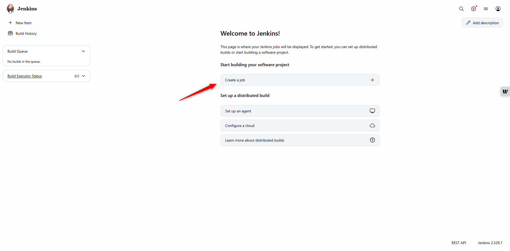

**11.2 Create a New Pipeline Job**

- Enter a name for the job — e.g. php-ci-cd-pipeline
- Select “Multibranch Pipeline” as the project type.
- Click OK to proceed.
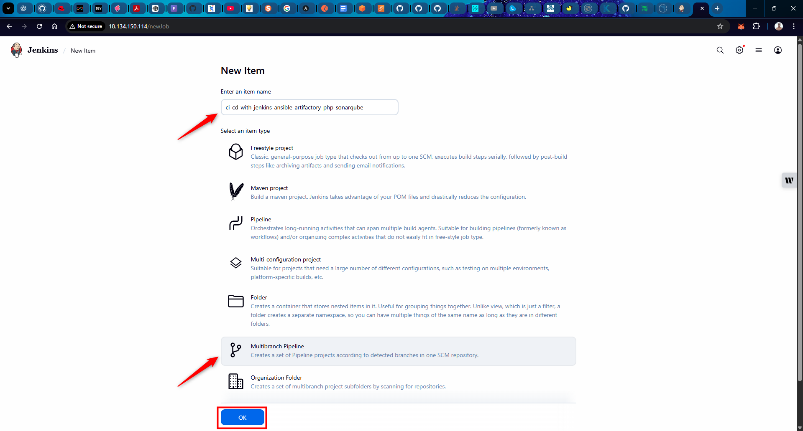

**11.3 Configure Source Code Management (Git)**

In the Pipeline job configuration page:

- Scroll to Pipeline → Definition and choose “Pipeline script from SCM.”
- Under SCM, select Git.
- Provide your repository URL, e.g.: `https://github.com/<your-username>/<your-repo>.git`

- Specify the Branch Specifier, e.g.: `*/main`
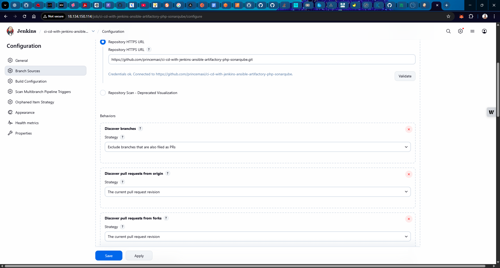

**11.4: Define the Jenkinsfile

- Set Script Path to:
    ```
    Jenkinsfile
    ```
- Save the configuration.

**11.5: Add Build Parameters**

- In the General section, tick: ✔️ This project is parameterized
- Add parameters:
  - String Parameter: inventory → default: dev
  - String Parameter: ansible_tags → default: (leave empty)

These parameters will let you deploy to different environments dynamically.

**11.6: Integrate SonarQube and Artifactory**

- Go to Manage Jenkins → Configure System.

- Scroll to:
  - SonarQube Servers → Add your SonarQube URL and credentials.
  - JFrog Artifactory → Add server ID, URL, and credentials.

Make sure to reference these IDs in your Jenkinsfile as configured in the pipeline.
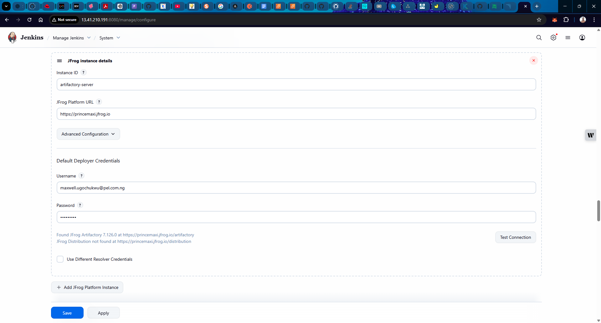

**11.7: Set Up GitHub Webhook**

- In your GitHub repository:

- Navigate to Settings → Webhooks → Add Webhook.

    Set:

  - Payload URL: `http://<your-jenkins-public-ip>:8080/github-webhook/`
  - Content Type: application/json
  - Trigger: “Just the push event”

- Save the webhook.
.
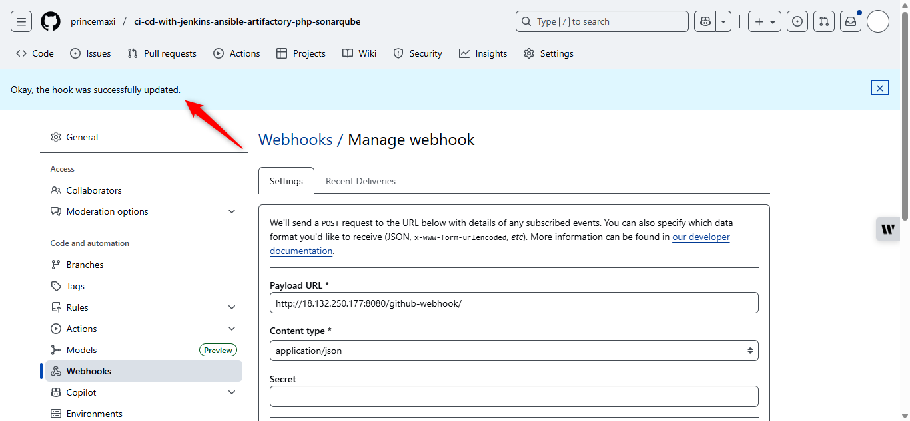

✅ Jenkins will now automatically trigger a build every time you push code to GitHub.

### Step 12: Pipeline Execution and Validation

Once all configurations (Jenkins, Ansible, SonarQube, Artifactory, and GitHub webhook) are complete, you can now execute and observe your full CI/CD pipeline in action.

This section walks you through triggering, monitoring, and validating a successful pipeline run.

**12.1 Triggering the Pipeline**

You can trigger the Jenkins pipeline in two ways:

Option 1: Automatic Trigger (Recommended)

This is handled by the GitHub Webhook configured earlier.
Every time you push a code change or merge a pull request into your main branch, Jenkins automatically starts a new pipeline build.
```bash
# Make some changes and push
git add .
git commit -m "Trigger Jenkins build via webhook"
git push origin main
```

✅ Jenkins will automatically receive the webhook payload and start a new build.

**Option 2: Manual Trigger**

You can manually trigger a build from Jenkins Dashboard.

**Steps:**

- Go to your Jenkins instance → `http://<your-jenkins-server>:8080`
- Click on your pipeline job name (e.g., PHP-CI-CD-Pipeline)
- Click “Build with Parameters”
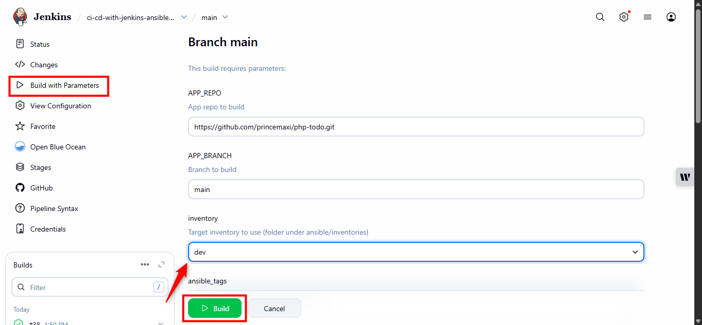

💡 A new build will appear in the Build History pane.

**12.2 Understanding the Pipeline Stages**

Your Jenkinsfile defines the following major stages:

| Stage                     | Description                                            | Example Command                                                                      |
| ------------------------- | ------------------------------------------------------ | ------------------------------------------------------------------------------------ |
| **Checkout**              | Clones the latest code from GitHub                     | `git clone`                                                                          |
| **Install Dependencies**  | Uses Composer to install PHP dependencies              | `composer install --optimize-autoloader`                                             |
| **Static Code Analysis**  | Runs SonarQube scan for code quality                   | `sonar-scanner`                                                                      |
| **Build & Package**       | Creates versioned artifacts and uploads to Artifactory | `curl -u admin:token -T artifact.zip "http://artifactory:8082/artifactory/php-app/"` |
| **Deploy to Environment** | Uses Ansible to deploy to the target environment       | `ansible-playbook -i inventory/dev site.yml`                                         |
| **Post-Deployment Test**  | Verifies application and Nginx response                | `curl -I http://<webserver-ip>`                                                      |

**12.3 Monitor in Jenkins Dashboard**

**Steps:**

- Navigate to your Jenkins dashboard → `http://<your-jenkins-server>:8080`
- Click on your pipeline job
- Click “Build History” → select the latest build
- View the Console Output
- You should see logs like:
```csharp
[Checkout] Checking out Git repository
[Composer Install] Installing dependencies...
[SonarQube Analysis] Running code quality scan...
[Deploy] Running Ansible playbook on target server...
[Post-Deploy Test] Application successfully deployed!
Finished: SUCCESS
```
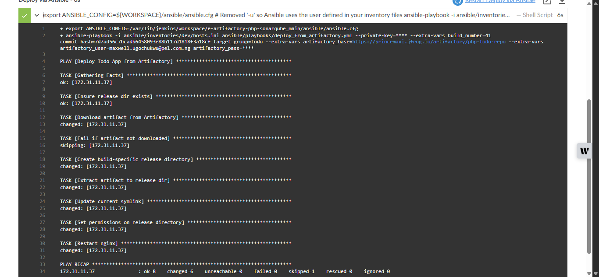

**12.4 Verify Pipeline via Blue Ocean (Visual View)**

Blue Ocean provides a modern visualization of your CI/CD flow.

**Steps:**

- Access Blue Ocean at:
`http://<your-jenkins-server>:8080/blue`
- Select your pipeline job
- Click the latest build → view each stage as a visual node
- Click any stage to expand logs and results

🟢 A successful pipeline will have all green nodes (no red or yellow).
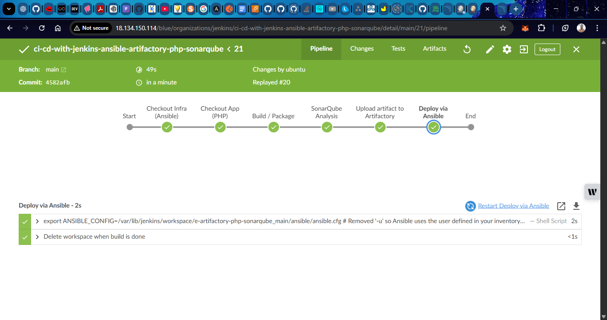

**12.5 Verifying Deployment on Web Server**

Once the pipeline completes, confirm that the deployed PHP application is live.

Commands:
```bash
# Test Nginx service
sudo systemctl status nginx

# Test web application
curl -I http://<web-server-ip>
```
Expected Output:
```
HTTP/1.1 200 OK
Server: nginx/1.26.3
Content-Type: text/html; charset=UTF-8
```

Or open your browser and go to:

🌐 `http://<your-web-server-public-ip>`

You should see your PHP application home page or the default/test index.php/info.php.

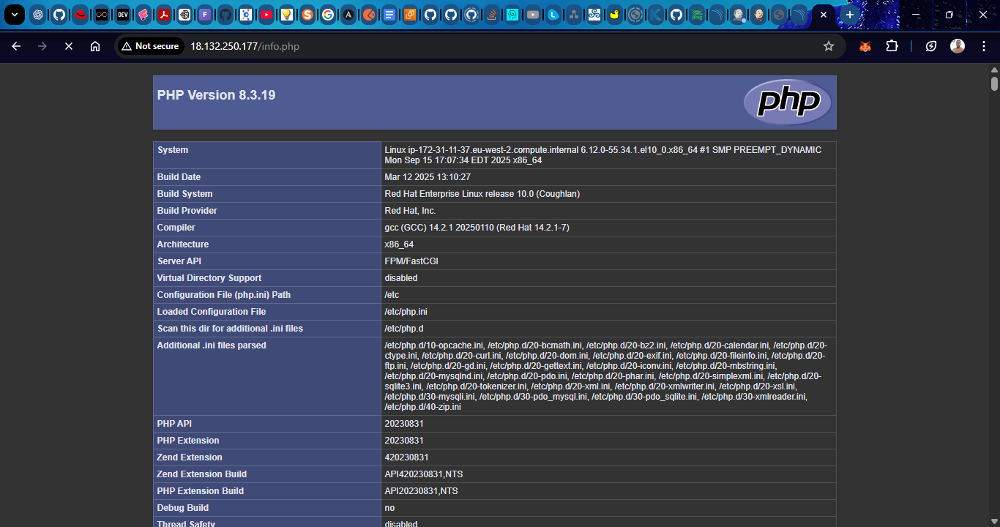

**12.6 Validating Artifactory and SonarQube Results**

- Artifactory:
Go to `http://<artifactory-server>:8082/artifactory`
→ Navigate to your repository → confirm your latest build artifact is uploaded.
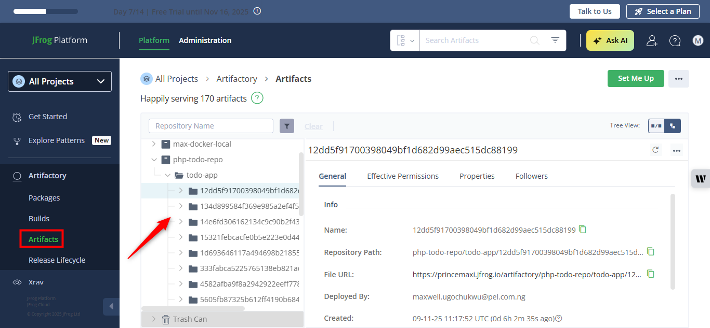

- SonarQube:
Go to `http://<sonarqube-server>:9000`
→ Open your project dashboard → view metrics such as bugs, code smells, and test coverage.
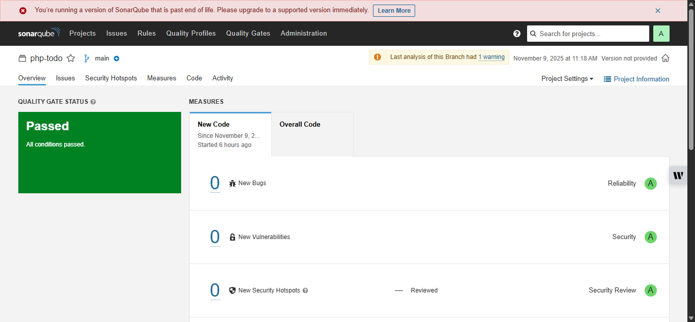


### ✅ Pipeline Execution Summary

| Component                      | Expected Result                    |
| ------------------------------ | ---------------------------------- |
| **Git Push → Jenkins Trigger** | Automatic build starts via webhook |
| **SonarQube Analysis**         | Quality gate passed                |
| **Artifact Upload**            | Artifact stored in Artifactory     |
| **Ansible Deployment**         | Web app deployed successfully      |
| **Blue Ocean**                 | All pipeline stages green          |
| **Web Access**                 | PHP app accessible via browser     |

## Troubleshooting Common Issues

| Issue                           | Cause                                      | Fix                                                     |
| ------------------------------- | ------------------------------------------ | ------------------------------------------------------- |
| ❌ “composer: command not found” | Composer not in PATH for Jenkins user      | Add `/usr/local/bin` to Jenkins PATH                    |
| ❌ “502 Bad Gateway”             | Nginx or PHP-FPM misconfiguration          | Restart PHP-FPM: `sudo systemctl restart php-fpm`       |
| ❌ “Permission denied”           | Jenkins user lacks SSH or file permissions | Ensure proper ownership and SSH key access              |
| ❌ “SonarQube connection failed” | Wrong token or URL                         | Verify SonarQube server URL and token in Jenkins config |

## Successful End-to-End Run

- When everything works, your CI/CD flow will:
- Detect a Git push event
- Pull new code
- Analyze code quality
- Build and upload artifact
- Deploy with Ansible
- Restart Nginx
- Verify success via browser

🎉 Congratulations!
You’ve successfully implemented a full CI/CD pipeline using Jenkins, Ansible, SonarQube, and Artifactory for a PHP-based application.
